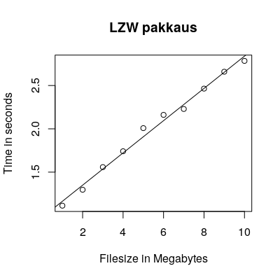
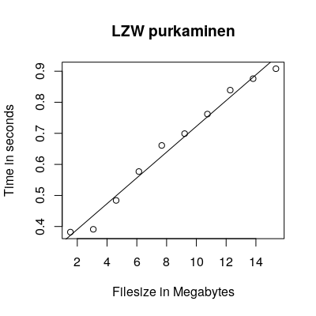

## Testausdokumentti

Yksikkötestit toteutettu junit:illa. 
Ne löytyvät kansiosta [src/test/java/compress](https://github.com/kotommi/pakkaaja/tree/master/src/test/java/compress).
Lisäksi tehty integraatiotestejä jotka tarkistavat että data pysyy häviöttömänä purku- ja pakkauskierroksen jälkeen.
### Vertailut

#### Yhteenveto
Itse toteutetut algoritmit häviävät gzipille pakkaussuhteessa ja käytetyssä ajassa. 
Varsinkin purkamisessa gzip on omaa luokkaansa.
E.coli-tiedostossa näkee kuitenkin että myös omat algoritmit saavuttavat hyvän pakkaussuhteen kun syöte käyttää pientä aakkostoa.
Omista toteutuksista Huffman on LZW:tä nopeampi, mutta sen pakkaussuhde on huonompi tavallisella tekstillä.

#### Testimetodit
Tiedostokoko on mitattu ```ls -la``` komentoa käyttöän ja se ilmoittaa tavujen määrän.
Pakkausuhde on laskettu kaavalla pakattu koko/alkuperäinen koko ja ilmoitettu prosentteina alkuperäisestä.

Ajan mittaus suoritettu unixin time ohjelmalla ja mittayksikkönä sen ilmoittama user time.
User time tarkoittaa käytettyä prosessoriaikaa joka laskee mukaan mahdollisesti moniytimisesti suoritetun laskennan lineaarisena. Ilmoitettu tulos on keskiarvo viidestä mittauksesta.

#### Vertailualgoritmi
 
Valitsin gzipin, koska sen DEFLATE-algoritmi on yhdistelmä Huffmania ja Lempel-Ziviä.
Lisäksi se on yleisesti käytössä.

Käytetyt tiedostot:
[The Large Canterbury Corpus](http://www.data-compression.info/Corpora/CanterburyCorpus/index.html)
* world192.txt - The CIA world fact book - 2473400 tavua
* bible.txt - The King James version of the bible - 4047392 tavua
* E.coli - Complete genome of the E. Coli bacterium - 4638690 tavua

Kaikki tiedostot ovat tekstiä. Lisäksi E.coli-tiedosto on hyvin toisteista pienellä aakkostolla.

|Nimi   |Algo   |Koko   |Pakattu koko   |Pakkaussuhde   |Pakkausaika   |Purkuaika   |
|---|---|---|---|---|---|---|
|world192.txt   |Huffman   |2473400   |1558878   |63.03%   |0.356   |0.312   |
|world192.txt   |LZW   |2473400   |1076274   |43.51%   |1.188   |0.402   |
|world192.txt   |gzip   |2473400   |724606   |29.29%   |0.085   |0.022   |
|bible.txt   |Huffman   |4047392   |2218640   |54.82%   |0.393   |0.369   |
|bible.txt   |LZW   |4047392   |1501028   |37.09%   |1.403   |0.426   |
|bible.txt   |gzip   |4047392   |1191071   |29.43%   |0.198   |0.025   |
|E.coli   |Huffman   |4638690   |1159686   |25.00%   |0.324   |0.291   |
|E.coli   |LZW   |4638690   |1342576   |28.94%   |1.338   |0.396   |
|E.coli   |gzip   |4638690   |1341250   |28.91%   |0.486   |0.030   |


### Suoritusnopeuden ja aikavaativuuden testaaminen
Otin satunnaista dataa testin toteutuksessa komennolla ```dd if=/dev/urandom of="$i"mfile bs=1M count=$i``` ja mittasin aikaa time-ohjelmalla.
Kuviin sovitettu kuvaaja on laskettu R:n lm-funktiolla joka tuottaa lineaarisen mallin.

Datan perusteella lineaarinen O(n) aikavaativuus tiedostokoon suhteen näyttäisi toteutuneen.






